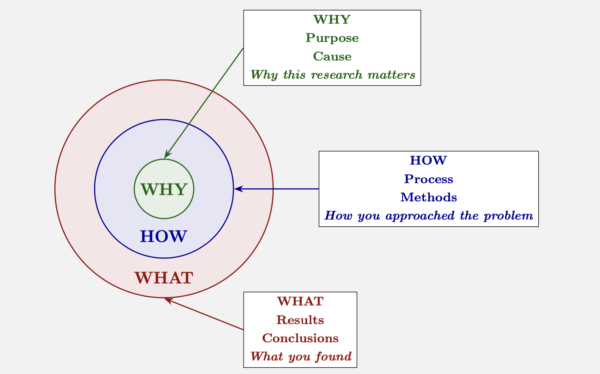

# **WHY**, **HOW**, and **WHAT** of Writing a Research Paper in Mathematics

**[Farid Aliniaeifard](https://faculty.sdu.edu.cn/FaridAliniaeifard/en/index/1921452/list/index.htm)**  
*Research Center for Mathematics and Interdisciplinary Sciences, Shandong University*  
*Frontiers Science Center for Nonlinear Expectations, Ministry of Education, Qingdao, Shandong, 266237, P. R. China*  
[farid@sdu.edu.cn](mailto:farid@sdu.edu.cn)

---

The typical way to write a research paper in mathematics is to present a linear sequence of logical statements that lead to a series of results, which can be boring and may cause the main results to be overlooked by the reader. We present a modern approach to writing, grounded in the discoveries of a framework called the Golden Circle that demonstrates how leaders can inspire others. Thus, we ensure our results receive the attention they deserve.

We begin by applying the Golden Circle framework to write an introduction, followed by an abstract. This helps us become familiar with the Golden Circle approach. Next, we incorporate Terrence Tao's concept of creating a rapid prototype [Tao] with the Golden Circle framework to develop the body of the paper.

## The Golden Circle and Writing an Introduction

### 🟢 **WHY**, 🔵 **HOW**, and 🔴 **WHAT**

**🟢 WHY do we write an introduction?** The introduction is the most critical section because it **informs** the reader by providing a clear, comprehensive overview of our work, its context, and its significance, and it **persuades** the reader (and possibly the referee) that our paper is worthy of their full attention and represents a valuable contribution to the field.

**🔵 HOW to write an introduction?** The fifth most viewed TED talk is "How great leaders inspire action" by Simon Sinek [sinek2009] with over 69 million views. He develops a framework called the Golden Circle that great organizations and leaders think, act, and communicate based on. 

We organize our introduction using Simon Sinek's Golden Circle framework. The core idea behind this framework is to promote an idea, product, or result by first explaining the 🟢 **WHY**, then the 🔵 **HOW**, and finally the 🔴 **WHAT**. Most people know what they do; some know how they do it, but only a few know why they do it. Explaining our work in the order of 🟢 **WHY**, 🔵 **HOW**, and 🔴 **WHAT** not only helps us to understand the purpose, process, and results of our research but also persuades others to care about it.

**🔴 WHAT is a well-crafted introduction?** A well-crafted introduction acts as a sales pitch, a roadmap, and provides the context to ensure that your key results and their significance are immediately visible and undeniable.

---

### **The Golden Circle Framework:**

> **🟢 (WHY)**  
> Start with **why this research matters**. Did you solve a fundamental problem? Did you fill a gap in the literature? Why didn't known methods work? Why should anyone care?
>
> **🔵 (HOW)**  
> Explain **how you approached the problem**. Did you use a new method, approach, or theoretical framework?
>
> **🔴 (WHAT)**  
> Present **what you found**, specific results, data, conclusions, and their significance.

---

### Structure and Content of an Introduction

Your introduction should clearly present the 🟢 **WHY**, followed by the 🔵 **HOW** and 🔴 **WHAT**, and also at the end include a roadmap outlining the results.

#### The Hook and Context (The 🟢 **WHY**)
The first paragraph, and especially the first sentence, of our introduction should serve two purposes: it should be informative and highlight the significance of our findings. We have already caught the reader's attention with our title and abstract; now is the time to strengthen that interest.

- **The Subject:** We begin with a compelling statement about the research field, then narrow down to the specific problem we addressed, and conclude by stating the overall objective of your paper. Thus, we begin by painting the broad picture and establishing the necessity of your work.
- **Historical Context and Literature:** Briefly, we situate our work within the existing field. We cite key prior works and, crucially, identify the *gap* or limitation that our paper addresses.
  - Mention a relevant survey article if one exists.
  - The goal is to set the stage for your contribution, not to provide an exhaustive history.
- **Motivation:** Explain why this problem is important, interesting, or challenging.

#### The Approach (The 🔵 **HOW**)
Briefly hint at the intellectual machinery and method of how you obtained your results.

- **Technical Insight:** Give a high-level idea of the key technique, method, or proof strategy. This helps experts see the novelty of your approach.
  - *Example:* "The key to our result is a new combinatorial formula for ..."

#### The Contribution (The 🔴 **WHAT**)
This is the core of your introduction, where you present your work's value.

- **Clear Statement of Results:** Describe your main results and findings.
- **Non-Technical Explanation:** Frame these results in non-technical way. If the full result is highly technical, use a simple but interesting special case or an analogy to convey the essence.
- **Novelty and Significance:** This is a place where you explicitly re-state why your work is new and important. Compare and contrast it with the literature.
  - *Example:* "Extending the finding of [1], we demonstrate that [X] is possible without the assumption of [Y]."
  - *Example:* "We provide a counterexample showing this bound cannot be improved."

#### The Roadmap
Guide the reader through the structure of your paper by writing a paragraph at the end of your introduction. Explicitly outline the structure of the rest of the paper, using section numbers. This is similar to a table of contents but presented in paragraph form.

### Conclusion

The main objective is to make it impossible for a reader to miss your main results and their importance. Your introduction must be a self-contained, persuasive narrative that answers the reader's core questions:

- 🟢 **Why** is this research important?
- 🔵 **How** it has been done?
- 🔴 **What** are the results? Are they **different/better**?
- 🔴 **What** can I expect to find in this paper?

By following this structure, you ensure that your results get the spotlight they deserve from the very first page.

## The Golden Circle and Writing an Abstract

Using the Golden Circle framework, we can write our abstract as follows.

> **Informative and attractive title**
>
> **Abstract.** 🟢 **WHY** the problem we are studying is important. We should state simply and briefly what problem we are studying.
>
> 🔵 **HOW** did we discover our results? Do we have any new methods or ideas?
>
> Finally, we state 🔴 **WHAT** we have discovered, then revisit our initial statement and explain 🟢 **WHY** our findings are significant by considering whether our results relate to other areas of mathematics, have practical applications, help solve well-known problems, or fill a gap in the literature.

## The Golden Circle and the Main Body

When you start writing the main body of your paper, you already have your results. Nonetheless, creating a logical and engaging manuscript can still be challenging. We use a map of ideas, a directed graph that gradually evolves to organize the paper. This approach will make writing more enjoyable, help readers follow your ideas more easily, and your results will get the attention that they deserve.

### Presenting the Elements of a Paper

Before starting to write a paper, we should understand what the elements of a paper are and how to name them. The building blocks of a mathematical paper are definitions and notation. Other elements include key results, which are presented as theorems, propositions, corollaries, and lemmas. Sections are used to separate ideas and present related results, with each section functioning like a short story. Subsections may also be added to improve the flow of the material.

The building blocks of a mathematical paper are two elements: the definitions and the notation. A *definition* introduces some terminology, and a *notation* is the explanation of a symbol.

A *theorem* is a major result and is one of the goals of the paper. If a result has its own importance but it is minor, call it a *proposition*. We call a minor result a *corollary* if it follows from other results of the paper with a relatively short proof, and a *lemma* is a statement that is needed in the proofs of other results of the paper.

A *remark* is a brief comment, and it should be independent of the flow of the story of the paper. A *conjecture* is a statement that authors believe to be true, but they don't have a proof.

### Writing the Paper Using a Directed Graph That Evolves

The prerequisite for writing a mathematical article is to have some results. It is not necessary to have all the definitions and notation before starting the paper; during the writing process, new definitions and notation may be needed. Additionally, new results may emerge.

The main idea is to build a directed graph step by step, where the vertices are the elements of the paper. We draw an edge from element $A$ to $B$ if $A$ is needed for $B$. A key requirement is that this graph must be acyclic; that is, it must not contain any directed cycles.

**Step 1.** We begin by writing down all elements that come to mind, including definitions, notation, and the approximate statements of theorems, propositions, corollaries, and lemmas. We do not include the proofs at this stage. Now, we treat each element as a vertex in a directed graph. Whenever we use an element $A$ in another element $B$, or anticipate that $A$ will be needed in $B$, we draw an edge from $A$ to $B$. This approach provides an overview and helps us organize our paper.

We may need to add or remove some hypotheses from the statement of the key results when writing their proofs. Therefore, until we have completed both the statement and the proof of a key result, we may not know which elements are necessary for that result.

**Step 2.** Write the proofs of key results in such a way that you clearly indicate which elements are used in each proof and if you need to add or remove some hypotheses. You do not need to complete the proofs. If necessary, introduce new definitions, notation, or results, and update the directed graph as needed.

**Step 3.** At this step, we complete the definitions and fully write out the statements of the key results. If necessary, we update our directed graph. Now, the precise structure of the directed graph should be clear.

**Step 4.** So far, we have an acyclic directed graph that includes all the elements of the paper. Because this graph is acyclic, there are several possible *topological orders* (a sequence of the vertices such that vertex $A$ precedes $B$ if there is an edge from $A$ to $B$). The order we choose should allow us to partition the paper into sections, each with its own narrative, making it possible to explain the 🟢 WHY, 🔵 HOW, and 🔴 WHAT of the results in that section.

**Step 5.** We write the abstract and introduction. Then, we complete the paper by ensuring that each section tells its own 🟢 WHY, 🔵 HOW, and 🔴 WHAT, and that the entire paper presents a cohesive story. During this process, we include any applications or additional elements that enhance the interest and value of your paper.

## References

1. S. Kleiman and G. Tesler, *Writing a Math Phase Two Paper*, February 2005. [KT]

2. S. Sinek, *How great leaders inspire action* [TED Talk]. TED. Retrieved from [https://www.ted.com/talks/simon_sinek_how_great_leaders_inspire_action](https://www.ted.com/talks/simon_sinek_how_great_leaders_inspire_action) [sinek2009]

3. T. Tao, *On writing*, blog post; [https://terrytao.wordpress.com/advice-on-writing-papers/](https://terrytao.wordpress.com/advice-on-writing-papers/). [Tao]
