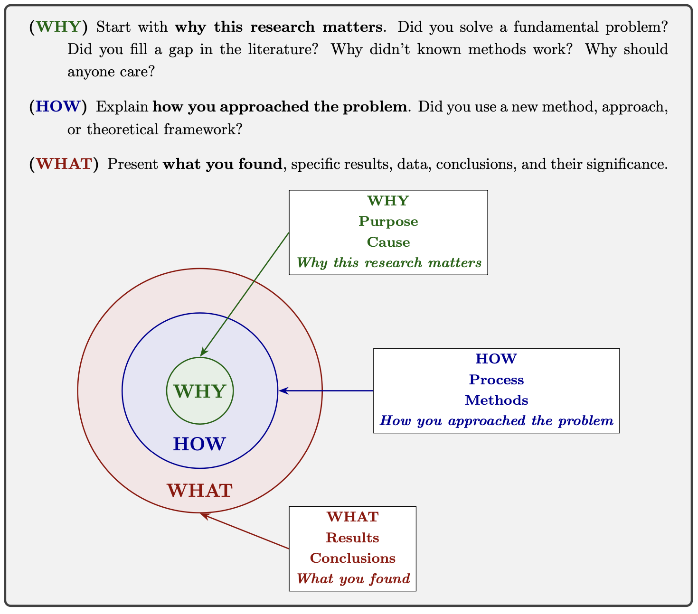

# **WHY**, **HOW**, and **WHAT** of Writing a Research Paper in Mathematics

**Farid Aliniaeifard**  
*Research Center for Mathematics and Interdisciplinary Sciences, Shandong University*  
*Frontiers Science Center for Nonlinear Expectations, Ministry of Education, Qingdao, Shandong, 266237, P. R. China*  
[farid@sdu.edu.cn](mailto:farid@sdu.edu.cn)

---

The typical way to write a research paper in mathematics is to present a linear sequence of logical statements that lead to a series of results, which can be boring and may cause the main results to be overlooked by the reader. We present a modern approach to writing, grounded in the discoveries of a framework called the Golden Circle that demonstrates how leaders can inspire others. Thus, we ensure our results receive the attention they deserve.

We begin by applying the Golden Circle framework to write an introduction, followed by an abstract. This helps us become familiar with the Golden Circle approach. Next, we incorporate Terrence Tao's concept of creating a rapid prototype [Tao] with the Golden Circle framework to develop the body of the paper.

---

## The Golden Circle and Writing an Introduction

### 🟢 **WHY**, 🔵 **HOW**, and 🔴 **WHAT**

**🟢 WHY do we write an introduction?** The introduction is the most critical section because it **informs** the reader by providing a clear, comprehensive overview of our work, its context, and its significance, and it **persuades** the reader (and possibly the referee) that our paper is worthy of their full attention and represents a valuable contribution to the field.

**🔵 HOW to write an introduction?** The fifth most viewed TED talk is "How great leaders inspire action" by Simon Sinek [sinek2009] with over 69 million views. He develops a framework called the Golden Circle that great organizations and leaders think, act, and communicate based on. 

We organize our introduction using Simon Sinek's Golden Circle framework. The core idea behind this framework is to promote an idea, product, or result by first explaining the **🟢 WHY**, then the **🔵 HOW**, and finally the **🔴 WHAT**. Most people know what they do; some know how they do it, but only a few know why they do it. Explaining our work in the order of **🟢 WHY**, **🔵 HOW**, and **🔴 WHAT** not only helps us to understand the purpose, process, and results of our research but also persuades others to care about it.

**🔴 WHAT is a well-crafted introduction?** A well-crafted introduction acts as a sales pitch, a roadmap, and provides the context to ensure that your key results and their significance are immediately visible and undeniable.

---

### **The Golden Circle Framework:**

> **🟢 (WHY)**  
> Start with **why this research matters**. Did you solve a fundamental problem? Did you fill a gap in the literature? Why didn't known methods work? Why should anyone care?
>
> **🔵 (HOW)**  
> Explain **how you approached the problem**. Did you use a new method, approach, or theoretical framework?
>
> **🔴 (WHAT)**  
> Present **what you found**, specific results, data, conclusions, and their significance.

---

### Structure and Content of an Introduction

Your introduction should clearly present the **🟢 WHY**, followed by the **🔵 HOW** and **🔴 WHAT**, and also include a roadmap outlining the results.

#### **The Hook and Context (The 🟢 WHY)**
The first paragraph, and especially the first sentence, of our introduction should serve two purposes: it should be informative and highlight the significance of our findings. We have already caught the reader's attention with our title and abstract; now is the time to strengthen that interest.

- **The Subject:** We begin with a compelling statement about the research field, then narrow down to the specific problem we addressed, and conclude by stating the overall objective of your paper. Thus, we begin by painting the broad picture and establishing the necessity of your work.
- **Historical Context and Literature:** Briefly, we situate our work within the existing field. We cite key prior works and, crucially, identify the *gap* or limitation that our paper addresses.
  - Mention a relevant survey article if one exists.
  - The goal is to set the stage for your contribution, not to provide an exhaustive history.
- **Motivation:** Explain why this problem is important, interesting, or challenging.

#### **The Approach (The 🔵 HOW)**
Briefly hint at the intellectual machinery and method.

- **Technical Insight:** Give a high-level idea of key techniques or proof strategies
- *Example:* "The key to our result is a new combinatorial formula for ..."

#### **The Contribution (The 🔴 WHAT)**
Present your work's value clearly.

- **Clear Statement of Results:** Describe main findings
- **Non-Technical Explanation:** Use analogies or special cases
- **Novelty and Significance:** Explicitly state what's new and important

#### **The Roadmap**
Guide the reader through the paper structure in a concluding paragraph.

---

## Writing an Abstract with the Golden Circle

> **Informative and attractive title**
>
> **Abstract.** **🟢 WHY** the problem we are studying is important. We should state simply and briefly what problem we are studying.
>
> **🔵 HOW** did we discover our results? Do we have any new methods or ideas?
>
> Finally, we state **🔴 WHAT** we have discovered, then revisit our initial statement and explain **🟢 WHY** our findings are significant.

---

## The Main Body: Directed Graph Approach

### Presenting Elements of a Paper

**Building Blocks:**
- *Definitions*: Introduce terminology
- *Notation*: Explain symbols

**Key Results:**
- **Theorems**: Major results
- **Propositions**: Minor but important results  
- **Corollaries**: Follow from other results with short proofs
- **Lemmas**: Needed for proofs of other results

**Other Elements:**
- *Remarks*: Brief comments
- *Conjectures*: Believed true but unproven

### Writing with an Evolving Directed Graph

**Step 1.** List all elements (definitions, notation, results) and create directed edges where element A is needed for element B.

**Step 2.** Write proofs indicating which elements are used, updating the graph as needed.

**Step 3.** Complete definitions and precise statements, finalize graph structure.

**Step 4.** Choose topological order that allows natural section narratives explaining **🟢 WHY**, **🔵 HOW**, and **🔴 WHAT**.

**Step 5.** Write abstract and introduction, ensuring each section tells its complete story.

---

## Conclusion

Make it impossible for readers to miss your main results by answering:

- **🟢 Why** is this research important?
- **🔵 How** was it done?  
- **🔴 What** are the results? Are they **different/better**?
- **🔴 What** can I expect in this paper?

---

## References

1. S. Kleiman and G. Tesler, *Writing a Math Phase Two Paper*, February 2005. [KT]

2. S. Sinek, *How great leaders inspire action* [TED Talk]. TED. Retrieved from [https://www.ted.com/talks/simon_sinek_how_great_leaders_inspire_action](https://www.ted.com/talks/simon_sinek_how_great_leaders_inspire_action) [sinek2009]

3. T. Tao, *On writing*, blog post; [https://terrytao.wordpress.com/advice-on-writing-papers/](https://terrytao.wordpress.com/advice-on-writing-papers/). [Tao]
